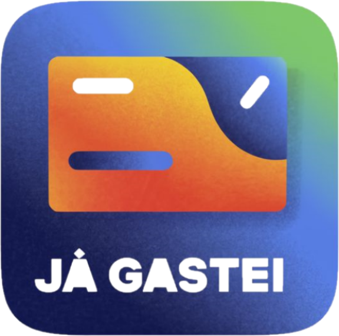

# TGoneFatec | Trabalho de Graduação ADS FATEC zona sul - V1.1

>Este repositório destina-se a documentar (mesmo que parcialmente) a parte conceitual e também a parte de elaboração de código fonte para meu trabalho de graduação no curso de [Análise e Desenvolvimento de Sistemas](https://fateczonasul.edu.br/) , este para a fase "one" do trabalho e o projeto #tgtwofatec destinado a fase "two". Não será um tutorial e tampouco um "step by step", colocarei aqui somente uma abordagem com as principais documentações necessárias.
- Para a fase "one" foi derterminado apenas a parte pertinente a documentação e prototipação.
- Para a fase "two" foi determinado o codigo fonte e a implementação.

## Histórico de revisões

| Versão | Data | Descrição|
|--------|------|----------|
| 1.0    |16/02/2024| Ideação, descrição do projeto e visão|
| 1.1    |25/03/2024| Design do logo e teste de colormetria|
| 1.2    |05/05/2024| Definições de Metas, RF, RN e RNF|
| 1.3    |10/06/2024| Diagramas e prototipação Figma|

---
## 📚 Documentação
- [x] Formulário de Proposta de Trabalho [aqui](Docs/proposta_tgi_assinada.png)

# tgonefatec
It's intended for phase 1 of FATEC's graduation work in the systems analysis and development course

## Descrição do Projeto

    

Projeto de um Aplicativo de finança pessoal que visa a possibilidade de visualizar e controlar em um único aplicativo, todos os gastos efetivados por cartão de crédito do usuário cadastrado, independentemente da quantidade de cartões que ele tenha, os gastos serão cadastrados via captura fotográfica do comprovante de compra e escaneamento do mesmo no OCR do aplicativo.

### Business 
O aplicativo proposto visa simplificar o gerenciamento financeiro, concentrando- se nos gastos com cartões de crédito.
Com abordagem única, oferece aos usuários uma experiência consolidada, onde todas as transações, independentemente dos cartões, são visualizadas em um local único, de modo que a captura fotográfica do comprovante de compra simplifica o registro de despesas, eliminando a necessidade de entrada manual. A integração do OCR melhora a precisão e eficiência no registro, reduzindo a carga de trabalho, bem como a gestão de múltiplos cartões proporciona uma visão unificada das finanças, e facilitando o controle.
Neste aplicativo, segurança é uma prioridade, com medidas avançadas de criptografia para proteger dados pessoais e financeiros. Em síntese, o aplicativo oferece uma solução integrada, fácil de usar e segura para o gerenciamento eficaz de gastos por cartão de crédito.

### Visão
A visão ideal para este aplicativo JáGastei é proporcionar aos usuários uma experiência eficiente no gerenciamento de suas compras por meio de cartão de crédito e abrange os seguintes pontos:

`Centralização` 
O aplicativo busca ser a central única para o gerenciamento financeiro, abrangendo informações de todos os cartões de crédito dos usuários. Oferece uma visão consolidada de gastos, proporcionando uma compreensão clara dos gastos realizados.

`Automatização`
O aplicativo automatiza processos, especialmente por meio do uso de tecnologias OCR, para eliminar tarefas manuais e aumentar a eficiência. A leitura automática de comprovantes, assim agrega valor ao proporcionar uma experiência rápida e sem complicações.
 
`Facilidade de uso`
É ideal que o aplicativo seja intuitivo e de fácil utilização, permitindo que usuários, independentemente de seu nível de familiaridade com tecnologia, possam gerenciar suas finanças de maneira simples. A captura fotográfica e o escaneamento OCR de comprovantes são projetados para simplificar o registro de despesas.

`Personalização`
A visão do futuro é que o aplicativo seja altamente personalizável, permitindo que os usuários adaptem a experiência de acordo com suas preferências individuais. Isso inclui a categorização flexível de gastos, relatórios personalizados e alertas de orçamento.
